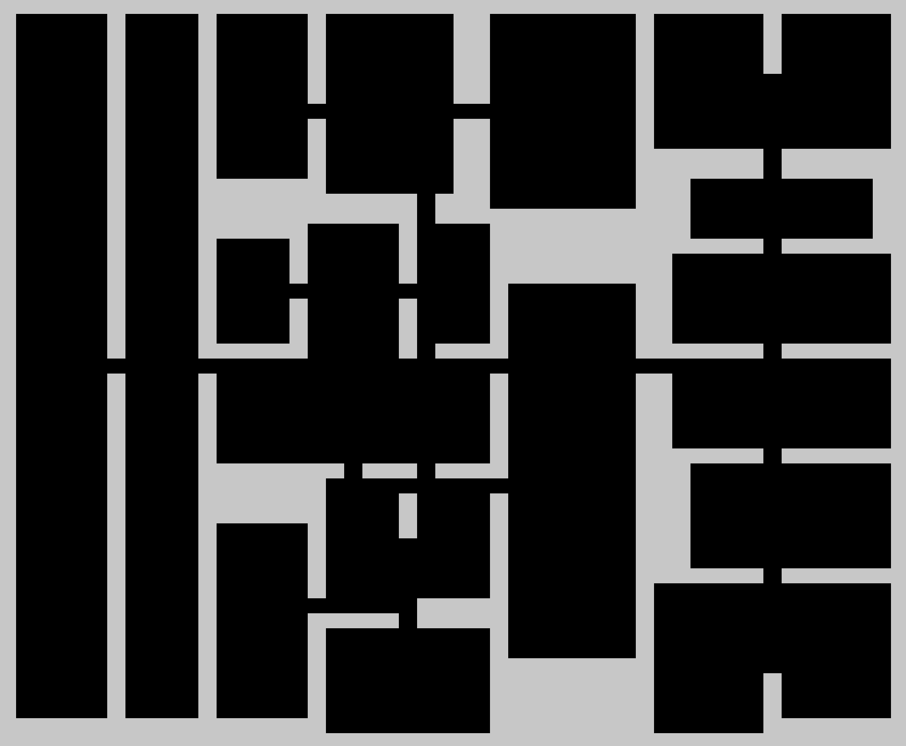
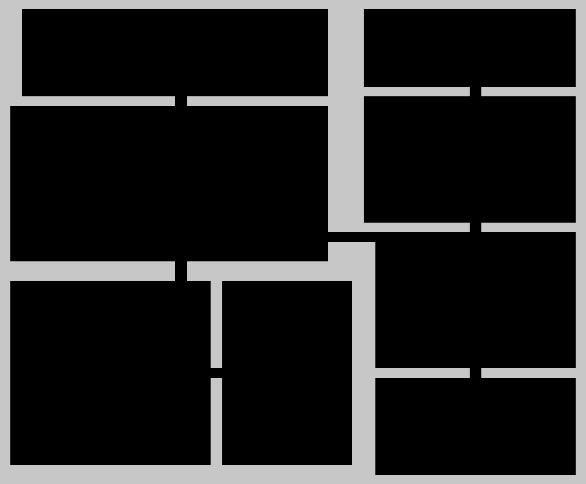

# bsp-generator

## Usage
```
int size = 100;
int minimalRoomSize = 6;
int differenceDivider = 4
Random rand = new Random();

BSPGenerator bspGen = new BSPGenerator(size, minimalRoomSize, differenceDivider, rand);
int[][] map = bspGen.generateMap();

for (int i = 0; i < map.length; i++) {
    for (int j = 0; j < map[0].length; j++)
        if (map[i][j] == 1) {
            System.out.print(" ");
        } else {
            System.out.print("0");
        }
    System.out.println();
```
## Variables

**size** - Size in tiles of the square map which is going to be generated.

**minimalRoomSize** - Minimal possible size of the room.

**differenceDivider** - The more this value is, the more will be mean room size.

**rand** - Instance of java.util.Random.

## Some results


  
  
